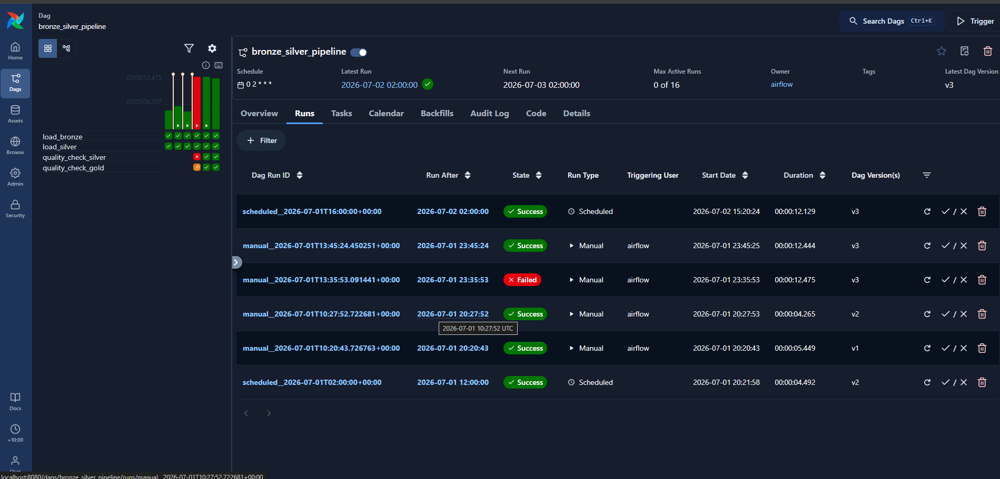

# SQL Data Warehouse with Airflow Orchestration

A SQL Server data warehouse built on the Medallion Architecture (Bronze, Silver, Gold), orchestrated end-to-end with Apache Airflow running in Docker.

**One-liner:** Took an existing SQL Server data warehouse project and built a full orchestration layer around it with Airflow and Docker — including debugging real infrastructure issues and adding automated data quality checks that gate the pipeline.

---

## Pipeline in Action



The DAG runs `load_bronze → load_silver → quality_check_silver → quality_check_gold` daily, only advancing to the next task if the previous one succeeds. The failed run above was `quality_check_silver` catching bad data and halting the pipeline before it could reach Gold — the fix and a clean rerun follow immediately after.

---

## Architecture

1. **Bronze Layer**: Raw data loaded as-is from source CSV files (CRM and ERP systems) into SQL Server via `BULK INSERT`.
2. **Silver Layer**: Cleansed, standardized, and normalized data, transformed from Bronze.
3. **Gold Layer**: Business-ready star schema (dimension and fact views) built on top of Silver, ready for analytics and reporting.

On top of this, **Apache Airflow** (running in Docker) automates the pipeline: it connects to SQL Server and runs the Bronze and Silver load procedures in order, on a daily schedule, with monitoring and logging through the Airflow UI.

---

## Tech Stack

- **SQL Server** — data warehouse engine (tables, stored procedures, views)
- **SSMS** — manual database administration and querying
- **Apache Airflow** — pipeline scheduling and orchestration
- **Docker / Docker Compose** — runs Airflow in isolated containers
- **Python** — Airflow DAG definitions

---

## Problem-Solving Highlights

**Docker container couldn't reach SQL Server ("Connection refused")**
SQL Server Express was running as a named instance (`SQLEXPRESS`) on a dynamic port with Windows Authentication only — neither works from inside a Docker container. Fixed by enabling SQL Server Authentication (Mixed Mode), creating a dedicated `airflow_user` login, enabling TCP/IP on a static port (1433), opening that port in the firewall, and verifying with `netstat` that SQL Server was actually listening before retesting.

**`BULK INSERT` permission error**
`db_owner` (database-level) doesn't cover `BULK INSERT`, which requires a server-level permission. Fixed by granting `ADMINISTER BULK OPERATIONS` to the Airflow SQL login at the server level.

**Hardcoded, environment-specific file paths**
The bronze load procedure had `BULK INSERT ... FROM 'C:\...'` paths pointing to a different machine's folder structure. Traced the mismatch through the actual error output and updated the stored procedure to match the real dataset location.

**Turning informal data-quality scripts into automated gates**
The project had "quality check" SQL scripts meant to be run manually and eyeballed (`-- Expectation: No Results`). Converted the genuine pass/fail checks (null/duplicate keys, invalid date ordering, referential integrity) into real Airflow tasks that fail the pipeline run if bad rows are found — while leaving purely exploratory checks out of automation since they have no fixed right answer. Hit a false positive almost immediately: a birthdate check flagged 15 rows using a cutoff of 1924. Investigated the flagged data, confirmed these were legitimate customers born in the early 1900s, and corrected the business rule rather than ignoring the failure or "fixing" data that wasn't actually broken.

---

## Repository Structure

```
AIRFLOW/
│
├── dags/                       # Airflow DAG definitions (Python)
│   └── bronze_silver_pipeline.py   # Orchestrates bronze -> silver load
│
├── datasets/                   # Raw source CSV files (CRM and ERP)
│
├── docs/                       # Architecture diagrams and data documentation
│   ├── data_architecture.png
│   ├── data_catalog.md
│   └── naming_conventions.md
│
├── scripts/                    # SQL scripts for the warehouse
│   ├── init_database.sql       # Creates the DataWarehouse database and schemas
│   ├── bronze/                 # DDL + stored procedure for raw data load
│   ├── silver/                 # DDL + stored procedure for cleansing/transforms
│   └── gold/                   # DDL for star-schema views
│
├── tests/                      # Data quality check scripts
│
├── config/, plugins/, logs/    # Airflow runtime folders (logs/ is git-ignored)
├── docker-compose.yaml         # Airflow services definition
├── .env                        # Local environment config (git-ignored)
├── LICENSE
└── README.md
```

---

## Setup

### 1. Database

1. Install SQL Server (Express edition is sufficient) and SSMS.
2. Run `scripts/init_database.sql` to create the `DataWarehouse` database and schemas.
3. Run the DDL and stored procedure scripts in order: `bronze/ddl_bronze.sql`, `bronze/proc_load_bronze.sql`, `silver/ddl_silver.sql`, `silver/proc_load_silver.sql`, `gold/ddl_gold.sql`.
4. Enable **SQL Server Authentication**, enable **TCP/IP** with a static port (1433), and open that port in the Windows Firewall so Airflow (in Docker) can reach it.

### 2. Airflow (Docker)

1. Install Docker Desktop.
2. From this project folder, run:
   ```
   docker compose up airflow-init
   docker compose up -d
   ```
3. Open the Airflow UI at `http://localhost:8080`.
4. Under **Admin → Connections**, add a connection (`mssql_datawarehouse`) pointing to SQL Server, using `host.docker.internal` as the host so the container can reach the database on the Windows host.
5. Unpause `bronze_silver_pipeline` — it runs daily at 2:00 AM (Brisbane time) and can also be triggered manually from the UI.

---

## License

This project is licensed under the [MIT License](LICENSE).
